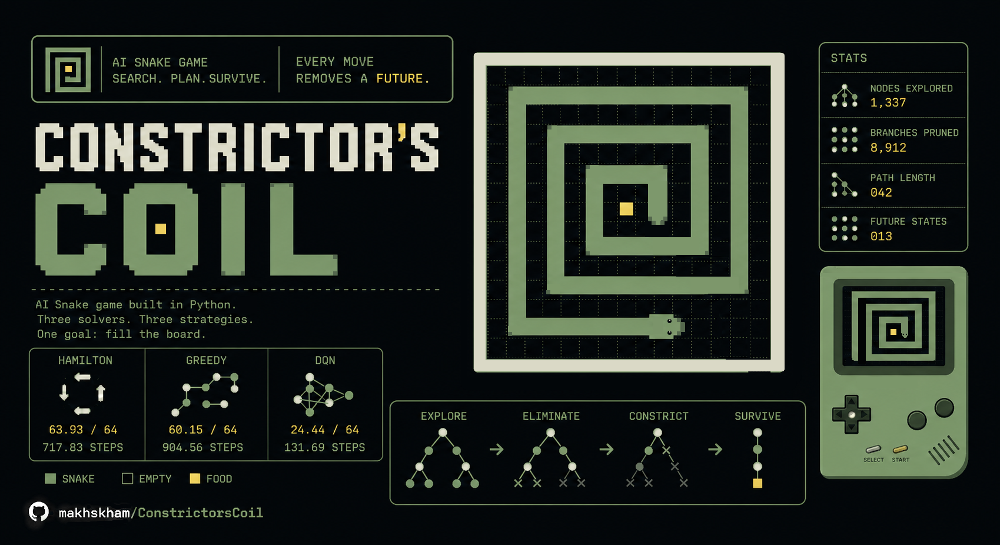

# Constrictor's Coil



[](https://aisnakegame.my.canva.site/)

An AI snake game built in Python, implementing four solvers ranging from classical graph algorithms to deep reinforcement learning. The Hamilton solver achieves near-perfect play, filling 99.9% of the map on average.

> Because every successful action literally constricts future possibilities so the snake isn't just growing, it's actually tightening the noose around itself.

---

## About

The project focuses on the artificial intelligence of the [Snake][snake-wiki] game. The snake's goal is to eat food continuously and fill the map with its body as quickly as possible. This version is written in Python with a Tkinter GUI and clean, modular algorithm implementations.

The game runs on an 8x8 grid (64 cells). The snake starts near the top-left corner facing right, with an initial length of 4. It can eat at most 60 pieces of food before filling the entire map.

Two families of solvers are implemented: classical graph-search solvers that are deterministic and explainable, and reinforcement learning solvers that learn through self-play. The graph-search solvers significantly outperform the RL solvers on this grid size, because the credit assignment problem is hard over long episodes.

---

## Solvers

| Solver | Grid | Strategy | Avg Length | Avg Steps |
| :----: | :--: | :------: | :--------: | :-------: |
| [Hamilton][doc-hamilton] | 8x8 | Hamiltonian cycle with shortcuts | 63.93 / 64 | 717.83 |
| [Greedy][doc-greedy] | 8x8 | Shortest path with safety lookahead | 60.15 / 64 | 904.56 |
| [DQN (TF)][doc-dqn] | 8x8 | Deep Q-Network (TensorFlow) | 24.44 / 64 | 131.69 |
| DQN (PyTorch) | 8x8 | Double DQN, requires training | -- | -- |
| RL (pretrained) | 6x6 | Double DQN, pretrained model included | -- | -- |

Results for the first three solvers averaged over 1000 episodes. The PyTorch DQN solver requires retraining -- see [Training](#training). The RL solver runs on a 6x6 grid using the included pretrained `rl_model.pt`.

---

## Algorithm Details

### Hamilton Solver

![][demo-hamilton]

Builds a Hamiltonian cycle across all 64 cells, then directs the snake along it. Because following the full cycle is inefficient, the solver takes shortcuts when it can safely skip ahead in the path without getting cut off.

The cycle is constructed once at the start by fixing the snake's initial head and body positions, then computing the longest path from head to tail and joining the endpoints into a cycle. Shortcut eligibility is checked at each step using the path index difference between the snake's head and the food.

This guarantees the snake never collides with itself and eventually fills the entire board. The average length of 63.93 reflects the rare cases where shortcuts slightly perturb the finishing position.

### Greedy Solver

![][demo-greedy]

At each step, the solver attempts to eat food along the shortest path. Before committing, it simulates the move and checks whether the snake's head can still reach its own tail afterward -- a proxy for long-term survival. If the safety check fails, the snake wanders by following the longest path to its tail instead.

Decision sequence per step:
1. Find shortest path P1 from head to food. If none, go to step 4.
2. Simulate snake S2 eating food along P1.
3. Find longest path from S2's head to its tail. If it exists, take direction P1[0]. Otherwise, go to step 4.
4. Find longest path P3 from S1's head to its tail. If it exists, take direction P3[0]. Otherwise, go to step 5.
5. Move in the direction that maximizes distance from food.

### DQN Solver

![][demo-dqn]

Three DQN implementations are included.

**TensorFlow version** (`-s dqn`): Uses a convolutional network with four conv layers (32, 64, 128, 256 filters) and two fully connected layers, trained with three simultaneous optimizations: Double DQN for stable target computation, Prioritized Experience Replay to focus learning on surprising transitions, and Dueling Network Architecture to separate state value from action advantage. Runs on an 8x8 grid.

**PyTorch version** (`-s dqn_torch`): Two conv layers (32, 64 filters) followed by two fully connected layers (256, 128 units), trained with Double DQN and soft target network updates. Epsilon decays linearly from 1.0 to 0.01 over 50k episodes. Runs on an 8x8 grid. Requires training before use -- see [Training](#training).

**Pretrained RL version** (`-s rl`): Same architecture as the PyTorch version but trained on a 6x6 grid. A pretrained model (`rl_model.pt`) is included in the repository and loads automatically. No training required. The smaller grid size makes the credit assignment problem easier, so this solver performs better out of the box.

All three versions use relative direction mode: actions are left, straight, or right relative to the snake's current heading rather than absolute map directions. This leverages rotational symmetry -- the network sees equivalent game states as equivalent inputs regardless of which way the snake is facing.

The state vector has two components:
- **Grid channels (NxNx4):** binary encodings of food position, body segments (normalized by snake length), head position, and danger cells (body segments that are not the tail)
- **Extra features (9):** one-hot current direction (4), one-hot food direction (4), normalized Manhattan distance to food (1)

The DQN solvers plateau below the classical solvers on the 8x8 grid. The reward for each food piece is separated from the eventual collision by hundreds of steps, making credit assignment difficult.

---

## Benchmarks

Tested with 1000 episodes per solver. Two metrics:

- **Average Length:** how far the snake grew before dying or finishing (max: 64)
- **Average Steps:** total moves taken

| Solver | Average Length | Average Steps |
| :----: | :------------: | :-----------: |
| Hamilton | 63.93 | 717.83 |
| Greedy | 60.15 | 904.56 |
| DQN (TF) | 24.44 | 131.69 |

The Hamilton solver is 6% longer on average than Greedy, but uses 21% fewer steps, because shortcuts aggressively reduce wasted movement. The DQN solvers underperform both classical approaches by a wide margin.

---

## Installation

Requirements: Python 3.10+ with [Tkinter][doc-tkinter] installed (included with standard Python on Windows and macOS).

```bash
pip install -r requirements.txt
python run.py [-h]
```

Run a specific solver:

```bash
# Hamilton (default)
python run.py -s hamilton

# Greedy
python run.py -s greedy

# DQN -- TensorFlow (requires tensorflow and a trained model in logs/)
python run.py -s dqn

# DQN -- PyTorch (requires model.pt in project root, see Training)
python run.py -s dqn_torch

# RL -- pretrained model on 6x6 grid (rl_model.pt included)
python run.py -s rl

# Benchmark mode (runs N episodes without GUI, prompts for episode count)
python run.py -s hamilton -m bcmk
```

Controls during play: `W/A/S/D` to override direction, `Space` to pause, `R` to restart, `Esc` to quit.

---

## Training

The PyTorch DQN solver must be trained before use. Training runs headless (no GUI) and logs progress every 200 episodes.

```bash
python train.py
# optional:
python train.py --episodes 100000 --out model.pt
```

Expected progress on a CUDA GPU:

```
Episode:  50000 | Avg reward/score:  44.97 / 17.56 | Elapsed:   67 mins | Device: cuda
Episode: 100000 | Avg reward/score: 140.22 / 22.93 | Elapsed:  422 mins | Device: cuda
```

When training finishes, output is saved as `model.pt.tmp.<timestamp>`. Rename it to `model.pt` in the project root, then run with `-s dqn_torch`.

To train the TensorFlow DQN solver through the game loop:

```bash
python run.py -s dqn -m train_dqn      # headless
python run.py -s dqn -m train_dqn_gui  # with GUI
```

---

## Project Structure

```
ConstrictorsCoil/
├── run.py                   # entrypoint, CLI argument parsing
├── train.py                 # standalone PyTorch DQN training script
├── requirements.txt
├── rl_model.pt              # pretrained RL model (6x6 grid)
├── constrictorscoil/
│   ├── game.py              # game loop, config, modes
│   ├── gui.py               # Tkinter rendering
│   ├── base/
│   │   ├── snake.py         # snake state and movement
│   │   ├── map.py           # game grid, cell types
│   │   ├── point.py         # coordinate primitive
│   │   ├── pos.py           # position utilities
│   │   └── direc.py         # direction enum
│   └── solver/
│       ├── base.py          # BaseSolver interface
│       ├── path.py          # BFS shortest path, heuristic longest path
│       ├── greedy.py        # Greedy solver
│       ├── hamilton.py      # Hamilton solver
│       ├── dqn/             # DQN solver (TensorFlow)
│       ├── dqn_torch/       # DQN solver (PyTorch, Double DQN, 8x8)
│       └── rl/              # RL solver (PyTorch, pretrained, 6x6)
├── assets/                  # cover art
├── docs/
│   ├── algorithms.md        # algorithm writeups with diagrams
│   └── images/              # demo GIFs, architecture diagrams
├── tests/
└── tools/
```

---

## Design Decisions

**Why Hamiltonian cycle for the strongest solver?** The snake game on a finite grid is a path-covering problem. A Hamiltonian cycle visits every cell exactly once, making it impossible to trap yourself. The only cost is inefficiency: without shortcuts, the snake spirals through the whole board even when the food is one step away. The shortcut logic recovers most of that efficiency while preserving the safety guarantee.

**Why relative direction for DQN?** The game map is symmetric under rotation. Training in the snake's own reference frame means the network sees equivalent situations as equivalent states rather than four different encodings depending on which way the snake is facing. This roughly doubles sample efficiency.

**Why BFS for shortest path and a heuristic for longest?** Shortest path on an unweighted grid is exactly what BFS solves optimally. Longest path on a general graph is NP-hard. The heuristic used here extends the shortest path by iteratively pushing path segments outward when space allows, producing good-enough results for the 8x8 grid without exponential cost.

**Why three DQN implementations?** The TensorFlow solver uses an older but more feature-complete training setup (Prioritized Experience Replay, Dueling Networks). The PyTorch 8x8 solver uses a cleaner, more modern codebase with Double DQN and soft target updates. The pretrained RL solver (`-s rl`) runs on the easier 6x6 grid where credit assignment is less severe, allowing the pretrained weights to generalize better out of the box without requiring the user to retrain.

**Why a separate 6x6 mode?** The RL solver ships with a pretrained model. The model was trained on a 6x6 grid, and its weight dimensions are fixed to that input size -- loading it into the 8x8 solver is impossible without retraining. Running the 6x6 game mode in the same project lets the pretrained model be used directly while the existing 8x8 solvers remain unchanged.

---

## License

See the [LICENSE](./LICENSE) file for license rights and limitations.

Built by Makhsuma Khamzaliyeva.

---

[snake-wiki]: https://en.wikipedia.org/wiki/Snake_(video_game)

[doc-tkinter]: https://docs.python.org/3/library/tkinter.html
[doc-algorithms]: ./docs/algorithms.md
[doc-greedy]: ./docs/algorithms.md#greedy-solver
[doc-hamilton]: ./docs/algorithms.md#hamilton-solver
[doc-dqn]: ./docs/algorithms.md#dqn-solver

[demo-hamilton]: ./docs/images/solver_hamilton.gif
[demo-greedy]: ./docs/images/solver_greedy.gif
[demo-dqn]: ./docs/images/solver_dqn.gif
